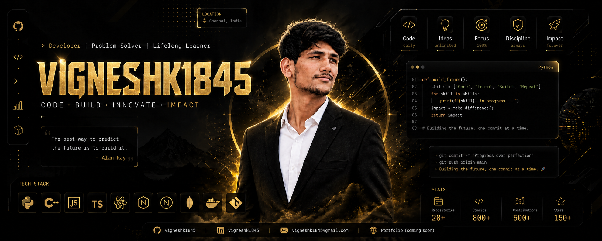

<!-- ============================================================
     Vignesh K — GitHub Profile README
     Theme: Black & Gold ✨
     ============================================================ -->

<div align="center">





<br/>


<p>
  
</p>

<p>
  <a href="https://linkedin.com/in/vignesh-k-948388315"></a>
  <a href="https://github.com/vigneshk1845"></a>
  <a href="https://leetcode.com/u/M9iiQQLnVQ"></a>
  <a href="mailto:vigneshk1845@gmail.com"></a>
</p>


</div>

<br/>

## 

```yaml
name: Vignesh K
role: Software Developer
education: B.Tech in Information Technology @ V.S.B Engineering College (2023 – Present)
location: Palani, Tamil Nadu, India
focus: Computer Vision • Machine Learning • Full-Stack Development
quote: "The best way to predict the future is to build it." — Alan Kay
```

> ✨ I'm a Computer Science undergrad who loves building things at the intersection of **AI/ML** and **practical software engineering** — from automated attendance systems to secure backend infrastructure. Sharpening my algorithmic edge on LeetCode while shipping full-stack projects that solve real problems.

<br/>

## 

<p>
  
  
  
  
</p>

**✦ Soft Skills:** Problem-Solving · Innovative Thinking · Leadership · Critical Thinking · Adaptability

<br/>

## 

<table>
<tr><th align="left">🎓 Institution</th><th align="left">Program</th><th align="left">Duration</th><th align="left">Location</th></tr>
<tr><td><b>V.S.B Engineering College</b></td><td>B.Tech, Information Technology (GPA: 7.8)</td><td>2023 – Present</td><td>Karur, Tamil Nadu</td></tr>
<tr><td><b>Veveaham Higher Secondary School</b></td><td>12th Standard</td><td>2022 – 2023</td><td>Dharapuram, Tamil Nadu</td></tr>
</table>

<br/>

## 

- 🏅 **NPTEL** — Java Certification
- 🏅 **Infosys** — Java Achievement
- 🏅 **Infosys** — Python Achievement

<br/>

## 

**💼 Software Developer Intern** — *Full-Stack Development Internship*
- ⚡ Gained hands-on experience with modern web technologies and frameworks
- ⚡ Sharpened problem-solving skills tackling algorithmic challenges on LeetCode using Java
- ⚡ Contributed to AI-driven projects involving machine learning applications
- ⚡ Collaborated across dynamic teams on ML/AI-powered initiatives

<br/>

## 

<table>
<tr>
<td width="50%" valign="top">

### 🎥 CV & ML Class Monitoring
Automated attendance tracking and classroom monitoring using **Computer Vision** and **Machine Learning**, streamlining class management processes.

</td>
<td width="50%" valign="top">

### 🔐 Smart API Manager
A secure API key management system with **encrypted storage** and **access control**, preventing unauthorized access to sensitive credentials.

</td>
</tr>
<tr>
<td width="50%" valign="top">

### 📋 Complaint Management System
Full-stack web app with **role-based access** (Admin/Teacher/Student) — complaint raising, assignment, and real-time status tracking.

</td>
<td width="50%" valign="top">

### 🚀 More Coming Soon
Currently exploring new ideas at the intersection of AI and full-stack development. Stay tuned!

</td>
</tr>
</table>

<br/>

## 

<div align="center">
  
  
</div>

<br/>

<div align="center">


### 

I'm always open to collaborating on interesting projects or discussing tech, AI, and problem-solving.

📧 **vigneshk1845@gmail.com** &nbsp;|&nbsp; 📱 **+91 93618 67898**

<sub>✨ Thanks for stopping by — feel free to explore my repos! ✨</sub>


</div>
